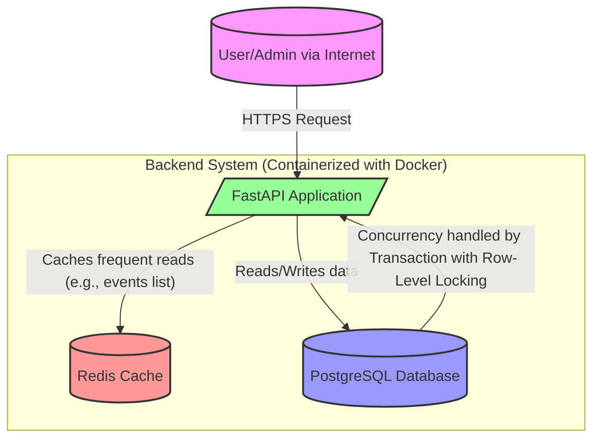
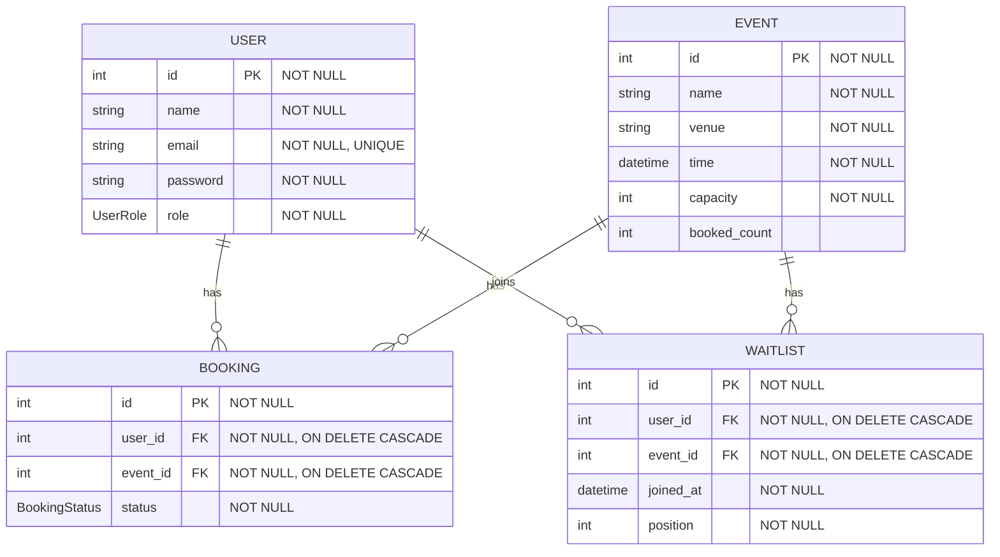

# Evently: A Scalable Event Booking Backend

Evently is a high-performance, scalable backend system designed for an event ticketing platform. It's built to handle the high concurrency demands of ticket sales, preventing overselling while providing a seamless experience for both users and administrators. The entire system is containerized with Docker for easy setup and deployment.

---

## 🚀 Live Demo & API Documentation

- **Live API Base URL:** ` https://backend-ticket-5owa.onrender.com`
- **Interactive API Docs (Swagger UI):** ` https://backend-ticket-5owa.onrender.com/docs`

---

## ✨ Key Features

- **User Management:** Create and manage users with distinct roles (USER, ADMIN)
- **Event Management:** Admins can create, update, and manage events, including capacity
- **Concurrent-Safe Booking:** Users can book and cancel tickets. The system guarantees no overselling, even under high load, using database-level locking
- **Automated Waitlist System:** Users can join a waitlist for a full event and are automatically promoted to a confirmed booking if a spot becomes available
- **Performance Caching:** Redis is used to cache frequently accessed data (like event lists and analytics) for rapid response times
- **Admin Analytics:** Endpoint for admins to view key metrics like total bookings, most popular events, and capacity utilization
- **Database Migrations:** Alembic manages all database schema changes, ensuring consistency across environments

---

## 🛠️ Technology Stack

| Technology | Description                                       |
| ---------- | ------------------------------------------------- |
| FastAPI    | High-performance Python web framework             |
| PostgreSQL | Robust relational database for data persistence   |
| SQLAlchemy | ORM for interacting with the database             |
| Redis      | In-memory data store for caching                  |
| Docker     | Containerization for the app and services         |
| Alembic    | Database schema migration tool                    |
| Pytest     | Framework for unit and integration testing        |
| Locust     | Tool for load testing and performance measurement |

---

## 🏛️ System Architecture

The architecture is designed for scalability and maintainability, with a clear separation between the API, caching, and database layers.



---

## 🗄️ Database Schema (ER Diagram)

The schema is normalized to ensure data integrity and efficiently handle relationships between entities.



---

## 🏁 Getting Started (Local Setup)

You can get the entire system running on your local machine with just a few commands, thanks to Docker.

### Prerequisites

- Docker
- Docker Compose

### Installation & Setup

1. **Clone the repository:**

   ```sh
   git clone https://github.com/utsav306/backend_ticket.git
   cd backend_ticket
   ```

2. **Create an environment file:**
   Copy the example environment file. The default values are already configured for the Docker setup.

   ```sh
   cp .env.example .env
   ```

3. **Build and run the services:**
   This command will build the Docker images and start the FastAPI application, PostgreSQL database, and Redis cache.

   ```sh
   docker-compose up --build -d
   ```

4. **Apply database migrations:**
   Run the Alembic migrations to create the necessary tables in the database.
   ```sh
   docker-compose exec backend alembic upgrade head
   ```

### You're all set!

- The API will be running at [http://localhost:8000](http://localhost:8000)
- Interactive API documentation (Swagger UI) is available at [http://localhost:8000/docs](http://localhost:8000/docs)

---

## 🧪 Running Tests

The project includes a comprehensive test suite to ensure reliability and performance.

### Unit and Integration Tests

Run the Pytest suite to check all core functionality:

```sh
docker-compose exec backend pytest
```

### Performance and Load Tests

Run the Locust load tests to simulate high traffic and verify the system's performance under pressure.

**Start Locust:**

```sh
docker-compose exec backend locust -f tests/locustfile.py --host http://backend:8000
```

---

## 📄 License

[MIT License](LICENSE)
